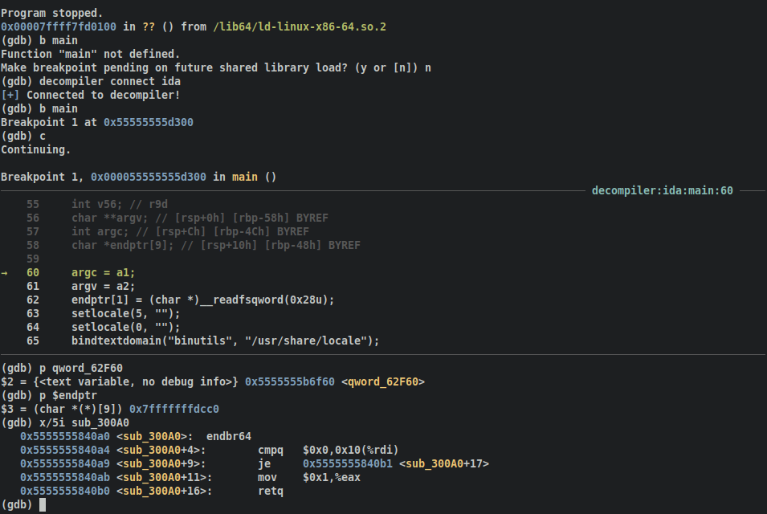

# decomp2dbg

Reverse engineering involves both static (decompiler) and dynamic (debugger) analysis, yet we often
use these analyses without sharing knowledge between the two. In the case of reversing static binaries, 
context switching between debugger assembly and the symbols you have reversed in decompilation can be inefficient.

decomp2dbg aims to shorten the gap of context switching between decompiler and debugger by introducing a generic
API for decompiler-to-debugger symbol syncing. In effect, giving the reverser the power of their debugger with
the symbols and decompilation lines they recover in their decompiler. 



Interested in seeing what decomp2dbg looks like in practice? Checkout the recorded [talk at CactusCon 2023](https://youtu.be/-J8fGMt6UmE?t=22442), 
featuring debugging a remote arm32 binary from a x64 machine with Ghidra symbols. 

For active help, join the BinSync Discord below, where we answer decomp2dbg questions:

[](https://discord.gg/wZSCeXnEvR)

## Supported Platforms
### Decompilers
- IDA Pro (>= 7.0): [Demo w/ GEF](https://asciinema.org/a/442740)
- Binary Ninja (>= 2.4): [Demo w/ GEF](https://t.co/M2IZd0fmi3)
- Ghidra (>= 10.1): [Demo w/ GEF](https://youtu.be/MK7N7uQTUNY)
- [angr-management](https://github.com/angr/angr-management) (>= 9.0)

### Debuggers
- gdb (works best with [GEF](https://github.com/hugsy/gef))
  - GEF
  - pwndbg
  - vanilla

## Install
Install through pip, then use the built-in installer for decompilers:
```bash
pip3 install decomp2dbg && decomp2dbg --install 
```

This will open a prompt where you be asked to input the path to your decompiler and debugger of choice. For Ghidra installs,
you must follow the extra steps to enable extensions [here](https://github.com/mahaloz/decomp2dbg/tree/main/decompilers/d2d_ghidra/README.md).
If you installed the decompiler-side in the Binja Plugin Manager, you still need to install the debugger side with the above.

**Note**: You may need to allow inbound connections on port 3662, or the port you use, for decomp2dbg to connect
to the decompiler. If you are installing decomp2dbg with GEF or pwndbg it's important that in your `~/.gdbinit` the
`d2d.py` file is sourced after GEF or pwndbg.

## Manual Install 

Skip this if you were able to use the above install with no errors.
If you can't use the above built-in script (non-WSL Windows install for the decompiler), follow the steps below:

If you only need the decompiler side of things, copy the associated decompiler plugin to the
decompiler's plugin folder. Here is how you do it in IDA:

First, clone the repo:
```
git clone https://github.com/mahaloz/decomp2dbg.git
```

Copy all the files in `./decompilers/d2d_ida/` into your ida `plugins` folder:
```bash
cp -r ./decompilers/d2d_ida/* /path/to/ida/plugins/
```

If you also need to install the gdb side of things, use the line below: 
```bash
pip3 install . && \
cp d2d.py ~/.d2d.py && echo "source ~/.d2d.py" >> ~/.gdbinit
```

## Usage 
First, start the decompilation server on your decompiler. You may want to wait
until your decompiler finishes its normal analysis before starting it. After normal analysis, this can be done by using the hotkey `Ctrl-Shift-D`,
or selecting the `decomp2dbg: configure` tab in your associated plugins tab. After starting the server, you should
see a message in your decompiler
```
[+] Starting XMLRPC server: localhost:3662
[+] Registered decompilation server!
```

Next, in your debugger, run:
```bash
decompiler connect <decompiler_name>
```

If you are running the decompiler on a VM or different machine, you can optionally provide the host and 
port to connect to. Here is an example:
```bash
decompiler connect ida --host 10.211.55.2 --port 3662
```

You can find out how to use all the commands by running the decompiler command with the `--help` flag.

The first connection can take up to 30 seconds to register depending on the amount of globals in the binary.
If all is well, you should see:
```bash
[+] Connected to decompiler!
```

If you are using decomp2dbg for a library, i.e. the main binary your debugger attached to is not the binary
you want source for, then you should take a look at the [Advanced Usage - Shared Libs](#shared-libraries) section
of the readme.

### Decompilation View
On each breakpoint event, you will now see decompilation printed, and the line you are on associated with
the break address. 

### Functions and Global Vars
Functions and Global Vars from your decompilation are now mapped into your GDB like normal Source-level 
symbols. This means normal GDB commands like printing and examination are native:
```bash
b sub_46340
x/10i sub_46340
```
```bash
p dword_267A2C 
x dword_267A2C
```

### Stack Vars, Register Vars, Func Args
Some variables that are stored locally in a function are stack variables. For the vars that can be mapped
to the stack or registers, we import them as convenience variables. You can see their contents like a normal GDB convenience
variable:
```bash 
p $v4
```

Stack variables will always store their address on the stack. To see what value is actually in that stack variable,
simply dereference the variable:
```bash
x $v4
```

This also works with function arguments if applicable (mileage may vary):
```bash
p $a1
```

Note: `$v4` in this case will only be mapped for as long as you are in the same function. Once you leave the function
it may be unmapped or remapped to another value.

## Advanced Usage
### Shared Libraries
When you want the decompilation (and symbols) displayed for a section of memory which is not the main binary, like when debugging a shared library, you need to do some extra steps. Currently, d2d only supports 1 decompiler connected at a time, which means if you currently have any decompilers connected that is not the library, you need to disconnect it.

After following the normal setup to have your decompiler running the d2d server for your shared library, you need to manually set the base address for this library and its end address:

```
decompiler connect ida --base-addr-start 0x00007ffff7452000 --base-addr-end 0x00007ffff766d000
```

To find the base address that your library is loaded at in memory, its recommend you use something like the `vmmap` command from GEF to look for the libraries name in the memory space. After connecting with this manually set address, symbols show work like normal d2d. Decompilation will only be printed on the screen when you are in the range of this address space. 

## Features
- [X] Auto-updating decompilation context view
- [X] Auto-syncing function names
- [X] Breakable/Inspectable symbols
- [X] Auto-syncing stack variable names
- [ ] Auto-syncing structs
- [ ] Online DWARF Creation
- [ ] Function Type Syncing
- [ ] lldb support
- [ ] windbg support
