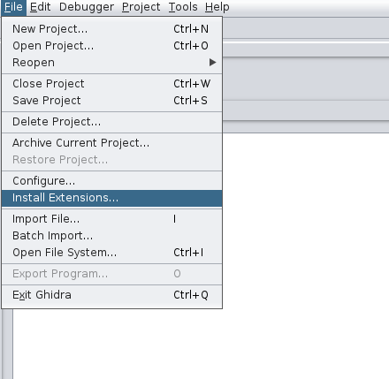

# d2d-ghidra-plugin
This is the plugin code for the Ghidra-side server of [decomp2dbg](https://github.com/mahaloz/decomp2dbg).
Please look at the decomp2dbg project docs for more info. 

## Installing
1. Follow the install steps at [decomp2dbg#install](https://github.com/mahaloz/decomp2dbg#install) using the built-in script
2. Start Ghidra
3. On the Project Window, click the tab `File->Install Extensions...`

4. Search in the filter for "d2d", and enable it by clickng on the box
	- If you don't see the d2d plugin, download the latest release from [here](https://github.com/mahaloz/decomp2dbg/releases/latest/download/d2d-ghidra-plugin.zip) and add it manually to the Extensions/Ghidra folder in your install.

5. Restart Ghidra
6. Open a binary, now click `File->Configure...` tab and enable `decomp2dbg` plugin.

You are done! Now you should be able to hit `Ctrl+Shift+D` to start the decomp2dbg server config. 
You can also find it in the `Tools` tab when you have a binary open.  
